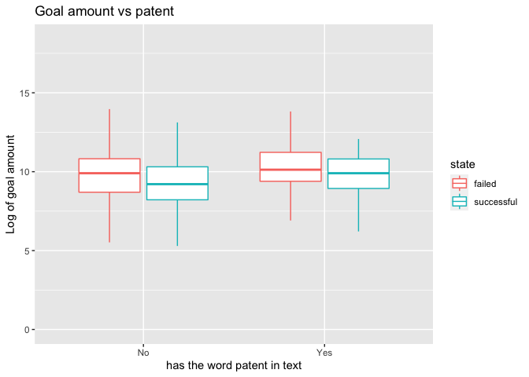

Summary
================
Carlos Siri
10/30/2020

## Description

## Data

The dataset consists of Kickstarter **Technology** projects. The
original dataset was obtained from
[webrobots](https://webrobots.io/kickstarter-datasets/ "webrobots").
This data was used to webscrape the listed URLs.

The dataset used for this analysis can be obtained from the following
link:
[Data](https://exploratory.io/data/cDb6UEd0cT/Kickstarter-YvT3sWY5YT "Data")

## Variables

**State**: Project state \[ Successful, Failed, Cancelled and Live\].
For this analysis I eliminated Canceled and Live.

**Goal**: The amount of funds the project owners wish to collect.

**Generated variables**

**Has\_Patent**: Generated binary variable reflecting if the text within
the site has the word patent.It outputsthe web scrapping results of the
target words \[Patent|patent\].

**log\_goal**: Log of goal amount.

## The effect of Has\_Patent and Goal

For an exploratory dasbhoard follow this link: [Has-Patent and
Goal](https://exploratory.io/dashboard/cDb6UEd0cT/Patent-vs-State-Duration-KTO9mmV1iv "Has-Patent and Goal")

## Relationship between patent and state

I explore the relationship between the **state** and **Has\_Patent**.

The Chi Square Test initially suggest that project with patents tend to
be less successful. The following sections show that this might be due
to some interactions.

    ##      
    ##       failed successful
    ##   No    3179       2916
    ##   Yes    247         98

    ## 
    ##  Pearson's Chi-squared test with Yates' continuity correction
    ## 
    ## data:  df_test$Has_Patent and df_test$state
    ## X-squared = 48.767, df = 1, p-value = 2.883e-12

The following dashboard also sumarizes the data:
[Dashboard](https://exploratory.io/dashboard/cDb6UEd0cT/Patent-vs-success-NGO6jii3fQ "Dashboard")

## The effect of Has\_Patent and Goal on State

This section explores the relationship between **Has\_Patent** and
**Goal** with **State**. The regression suggests that **Has\_Patent**
and **Goal** has an effect on **state**, there is also some interaction
(p\<.1) between **Has\_Patent** and **Goal**.

<!-- -->

    ## 
    ## Call:
    ## glm(formula = binstate ~ Has_Patent + goal + Has_Patent * goal, 
    ##     family = binomial(), data = df_test)
    ## 
    ## Deviance Residuals: 
    ##     Min       1Q   Median       3Q      Max  
    ## -1.2331  -1.1808  -0.6651   1.1482   3.4578  
    ## 
    ## Coefficients:
    ##                      Estimate Std. Error z value Pr(>|z|)    
    ## (Intercept)         1.301e-01  3.118e-02   4.172 3.01e-05 ***
    ## Has_PatentYes      -5.674e-01  1.676e-01  -3.386 0.000708 ***
    ## goal               -6.106e-06  5.757e-07 -10.606  < 2e-16 ***
    ## Has_PatentYes:goal -6.115e-06  3.576e-06  -1.710 0.087280 .  
    ## ---
    ## Signif. codes:  0 '***' 0.001 '**' 0.01 '*' 0.05 '.' 0.1 ' ' 1
    ## 
    ## (Dispersion parameter for binomial family taken to be 1)
    ## 
    ##     Null deviance: 8901.4  on 6439  degrees of freedom
    ## Residual deviance: 8614.0  on 6436  degrees of freedom
    ## AIC: 8622
    ## 
    ## Number of Fisher Scoring iterations: 8
